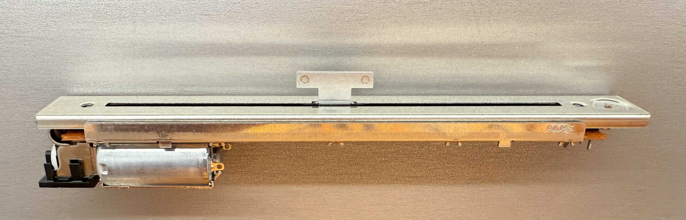

# Motorized Slider Component for ESPHome



## What Does the Component Do?

The motorized_slider component controls a motorized slider system, which can be used for positioning an element (for example, a slider or detent mechanism) with force‐feedback. It uses PWM outputs to drive the motor, an ADC input to sense position, and a state machine to manage different operating modes. The component supports:

- **Trajectory Following** – Moves the slider to a target position using a planned motion profile (fast P control).
- **Force Feedback** – Applies a restoring force when the slider deviates from preset "rastpunkte" (detents), with damping and friction compensation.
- **Manual Override Detection** – Detects when the user manually moves the slider and temporarily disables force feedback.
- **Self-Initialization and Calibration** – Automatically performs initialization steps including moving the slider to middle, autotuning filter parameters, and determining friction parameters.

## Prerequisites

Before using this component, ensure you have the following:

- **ESPHome Installation:** Make sure you have ESPHome set up and running.
- **ESP32S2 or ESP32S3 Board:** This component is designed for ESP32S2 or ESP32S3 boards.
- **Espressif IDF:** The Espressif IDF (IoT Development Framework) is required. 

## Motorized Slider Details (ALPS RS60N11M9)

The motorized slider component is designed to work with motorized faders like the ALPS RS60N11M9. This particular fader has the following characteristics:

- **Resistance:** 5 kΩ
- **Type:** Linear
- **Motorized:** Includes an integrated DC motor for automated control.

## Example Configuration

Below is an example YAML configuration for using this component in ESPHome:

```yaml
motorized_slider:
  id: my_motor_controller
  pwm_forward: motor_2_r        # ID of the forward PWM output
  pwm_backward: motor_2_l       # ID of the backward PWM output
  sensor_pin: 9                 # ADC pin to read slider position; validated via a custom ADC PIN validator
  rastpunkte:
    - position: 0.0
      stiffness: 0.9
    - position: 25.0
      stiffness: 0.9
    - position: 50.0  
      stiffness: 1.0
    - position: 75.0
      stiffness: 1.0
    - position: 100.0
      stiffness: 0.9
  target_position: 42           # The desired target position (0-100 scale)
  slider_position_sensor:
    name: "Slider Position"
    id: slider_position
    device_class: distance
    state_class: measurement
    filters:
      - or: 
          - delta: 2
          - throttle: 100sec
```
Additionally, you’d configure PWM outputs for the motor:
```yaml
output:
  - platform: ledc
    pin: GPIO11
    id: motor_2_r
    frequency: 19531Hz

  - platform: ledc
    pin: GPIO10
    id: motor_2_l
    frequency: 19531Hz
```

This PWM needs to fed into a H-bridge to control the DC motor of the motorized slider. 5V operating voltage recommended.

The slider needs to be connected according to [ALPS RS60N11M9 datasheet](https://tech.alpsalpine.com/e/products/detail/RS60N11M9A0E/) as a voltage divider.
3.3V is applied over the terminals. On + side an additional resistor of 1kOhm is needed.


# Warning! 

This works with my setup. The controller was insanely difficult to create and adjust. The slider has a lot of non-linear friction. For the force feedback there is no force signal just the noisy position signal. A hardware timer is used with 1ms, as the default loop rate of ESPHome was way too slow.
Suggestions are welcome, just do not expect this to work right out of the box.


---

The component is implemented as a C++ class (MotorController) that inherits from esphome::Component, along with additional interfaces for output control and sensor integration. Its files are split into a header (motorized_slider.h) and source file (motorized_slider.cpp).

## Main Functions and Their Roles

## Main Functions and Their Roles

*   `setup()`

  Configures the ADC (e.g., sets ADC width, attenuation), creates and starts a periodic timer that calls `on_timer()` at a fixed interval (every 1 ms in this case). It also performs any motor-specific initialization on first boot.
*   `initialize_motor()`

  Implements a sub-state machine (with states such as `WAIT_WIFI`, `MOVE_TO_MIDDLE`, `AUTOTUNE`, `DETECT_FRICTION`, etc.) to move the motor to a middle position, tune Kalman filter parameters, and determine friction values. This must be completed before normal operation begins.

### Periodic Processing

*   `on_timer()`

  The core periodic function called by a hardware timer. It:

  *   Reads the current position (via ADC) and computes the velocity (using a PT1 filter).
  *   Checks for manual override.
  *   Implements a state machine with four states:
    *   `INITIALIZE` – Waits until the motor is initialized.
    *   `IDLE` – Waits when no movement is commanded.
    *   `MOVE2POS` – Follows a planned trajectory to move the slider toward a target position using PID control.
    *   `FORCEFEEDBACK` – Applies force feedback (via `set_force_feedback_torque()`) to simulate detents when the slider is not already moving toward the target.
  *   Delegates to state-specific functions such as updating motor torque or following a trajectory.

### Motion Control and PID

*   `move_to_position(float target_position)`

  Uses a PID controller to compute the required torque to move the slider from its current position toward a target position. Implements anti-windup for the integral term.
*   `follow_trajectory()`

  Uses pre-calculated trajectory parameters (from `plan_trajectory()`) for smooth motion between positions. Returns `true` when the target is reached.

### Force Feedback

*   `calculate_rastpunkt_force(bool printlog)`

  Determines a restoring force based on the slider’s current position relative to the nearest “rastpunkt” (detent). It takes into account stiffness values defined in the configuration along with a blending factor and applies damping based on current velocity.
*   `set_force_feedback_torque()`

  Applies the calculated force (from `calculate_rastpunkt_force()`) to the motor by setting the PWM levels on the forward or backward channels.

### Friction Compensation

*   `calculate_friction()`

  Implements a Stribeck-like friction model using defined coefficients. It computes the friction force depending on the current motor velocity, ensuring that friction compensation is balanced across low and high speeds.
*   `determine_friction()`

  Runs an initialization routine that methodically increases torque (both forward and backward) to determine the friction level of the system.

### Manual Override Detection

*   `check_manual_override()` and `monitor_manual_movements()`

  These functions analyze position and velocity changes (using a history buffer) to detect if the slider is being moved manually. If an override is detected, the state machine in `on_timer()` transitions to disable trajectory control in favor of force feedback.

### Sensor Integration

The component can interface with an external sensor (configured via YAML under `slider_position_sensor:`) to publish the slider’s position back to Home Assistant.

